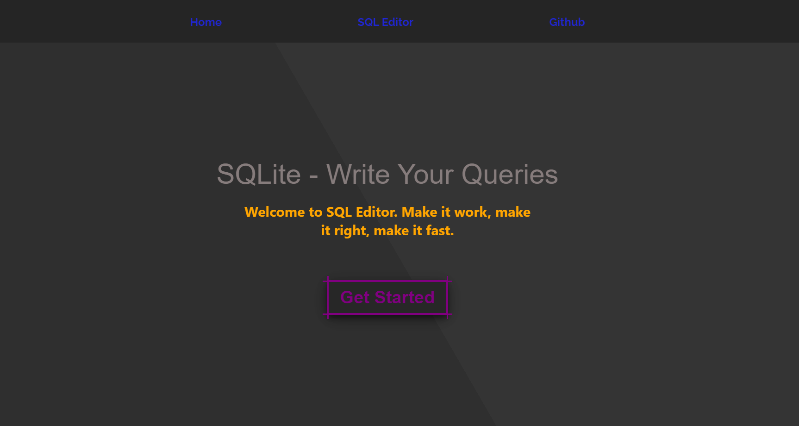
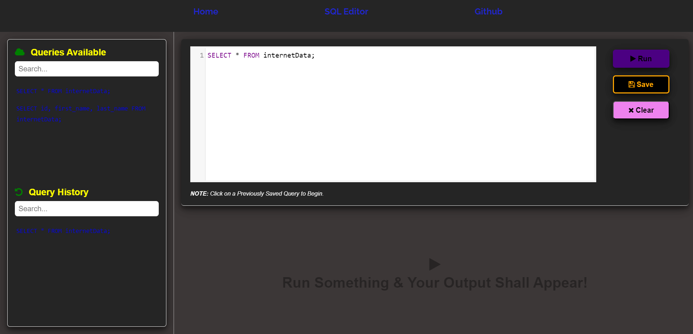
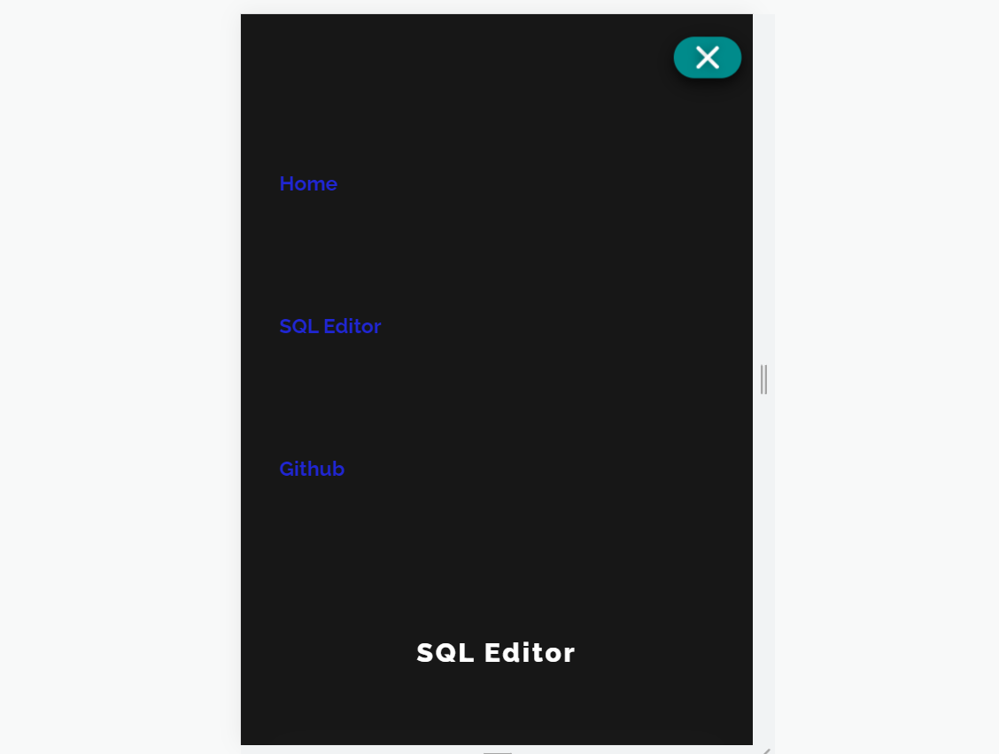

# SQLite





The primary goal of SQLite is to facilitate users in executing SQL queries within an online editor and subsequently examining the resulting outputs. This encompasses the ability to run diverse queries on tables and review corresponding table data. Some of the queries supported include ALTER TABLE, ANALYZE, CREATE VIEW, and DROP TABLE.

## Table of Contents

- [Features](#features)
- [Demo](#demo)
- [Technologies Used](#technologies-used)
- [Installation](#installation)
- [Usage](#usage)
- [Contributing](#contributing)


## Features

- Perform CRUD operations on a SQLite database.
- Display data in a user-friendly interface.
- Responsive design for mobile and desktop use.

## Demo

You can try out the SQLite live [here](https://sqleditor-sqlite-omgupta.netlify.app/).

## Technologies Used

- HTML5
- CSS3
- JavaScript (ES6+)
- React
- SQL

## Installation

To run this project locally, follow these steps:

1. Clone the repository:

    ```bash
    git clone https://github.com/omgupta7352/SQLite.git
    ```

2. Navigate to the project directory:

    ```bash
    cd sqlite_project
    ```

3. Install the dependencies:

    ```bash
    npm install
    ```

4. Set up the SQLite database:
    - Ensure you have SQLite installed on your machine.
    - Create a new SQLite database and set up the required tables.

5. Start the development server:

    ```bash
    npm start
    ```

6. Open your web browser and go to `http://localhost:3000`.

## Usage

1. Open the application in your web browser.
2. Use the interface to perform CRUD operations on the SQLite database.
3. Add, view, edit, and delete records as needed.

## Contributing

Contributions are welcome! If you would like to contribute to this project, please follow these steps:

1. Fork the repository.
2. Create a new branch for your feature or bugfix:

    ```bash
    git checkout -b feature/your-feature-name
    ```

3. Commit your changes:

    ```bash
    git commit -m 'Add some feature'
    ```

4. Push to the branch:

    ```bash
    git push origin feature/your-feature-name
    ```

5. Open a pull request on GitHub.

